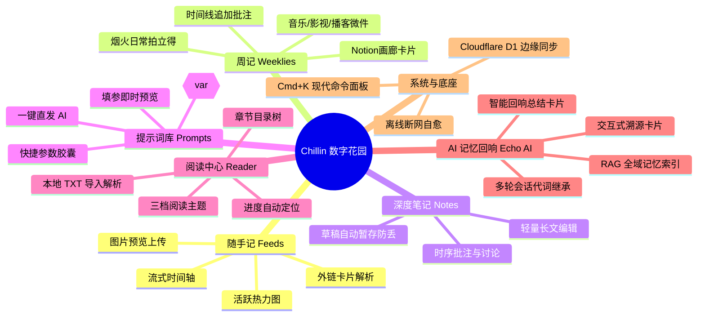

# Chillin 数字花园：产品全景与技术工程治理深度报告

> **编制对象**：产品经理 (Product Manager) / 技术负责人  
> **报告版本**：v2.5 (2026 年度技术与产品审计)  
> **应用形态**：Web / PWA (跨平台极速响应)  
> **在线基准**：Pages 前端 + Cloudflare Worker 边缘无服务架构 + Cloudflare D1 边缘关系型存储  

---

## 目录
1. [产品定位与核心价值主张 (Value Proposition)](#1-产品定位与核心价值主张)
2. [目标用户画像与核心使用场景 (User Personas & Scenarios)](#2-目标用户画像与核心使用场景)
3. [核心功能矩阵与业务能力拆解 (Feature Breakdown)](#3-核心功能矩阵与业务能力拆解)
4. [产品体验与交互设计护城河 (UX/UI & Design System)](#4-产品体验与交互设计护城河)
5. [AI 记忆回响系统 (RAG) 商业与体验价值](#5-ai-记忆回响系统-rag-商业与体验价值)
6. [技术架构、性能优势与工程化治理 (Technical Architecture)](#6-技术架构性能优势与工程化治理)
7. [竞品横向对比与差异化优势 (Competitive Analysis)](#7-竞品横向对比与差异化优势)
8. [未来演进路线图建议 (Product Roadmap)](#8-未来演进路线图建议)

---

## 1. 产品定位与核心价值主张

### 1.1 产品定义
**Chillin** 是一款兼具**极致轻量、数据高自主可控与 AI 深度联想**的个人跨端「数字花园（Digital Garden）」。它打破了传统笔记软件（笨重、层级复杂、输入负担大）与碎片记录工具（易记难寻、缺乏归纳、信息孤岛）之间的壁垒，为用户提供一个**随手记录即成脉络、长久沉淀可被 AI 唤醒**的私人心智空间。

### 1.2 核心价值金字塔
```
             ▲
            / \     【顶层：心智共鸣】
           /AI \    AI 记忆回响（RAG 全域联想，自动生成回响卡片）
          / 回响 \
         /--------\ 【中层：知识编织】
        / 结构化   \ 深度周记、时序批注、提示词库、阅读沉淀
       / 记录与阅读 \
      /--------------\ 【底层：极速输入与绝对自主】
     / 随手记 / 离线PWA \ 0依赖极速启动、多端秒同步、单机离线可用
    /____________________\
```

* **零摩擦捕获 (Zero-Friction Capture)**：随手记 1 秒内完成记录，支持富链接自动抓取与图片上传，无排版心理负担。
* **沉浸式回顾 (Curated Retrospective)**：独特的周记画廊与微件系统（音乐、影视、烟火日常、播客），将生活切片沉淀为视觉化美学展厅。
* **第二大脑回响 (Second Brain Echo)**：不是冷冰冰的全文搜索，而是基于个人真实记录的 AI 交互 RAG 助手，让往期记忆能够“主动对答”。

---

## 2. 目标用户画像与核心使用场景

| 用户类型 | 典型画像 | 核心痛点 | Chillin 解决方案 |
| :--- | :--- | :--- | :--- |
| **知识工作者 / 独立开发者** | 习惯高频记录代码片段、设计灵感、AI Prompt 模板、思考笔记 | 传统笔记软件太重，手机端打开慢，Prompt 变量替换繁琐 | 毫秒级秒开；内置带参数填写的提示词库（Prompt Studio）；支持一键直发 AI |
| **生活记录者 / 自省复盘者** | 喜欢每周写复盘，记录看过的电影、听过的歌、日常照片与感悟 | 微信朋友圈太公开，Notion 手机端排版卡顿反人类 | 模块化周记系统，自适应封面，拍立得生活照片墙，私密安全 |
| **重度阅读与学习者** | 经常阅读长篇小说、行业研报、技术专著 | 阅读 App 广告多、无法就地联动记笔记 | 内置 TXT 书架与阅读器，支持目录智能解析、护眼模式与长久进度记忆 |
| **高流动性 / 移动办公族** | 常在地铁、飞机、弱网环境下记录，多设备频繁切换 | 断网无法加载，数据同步冲突覆盖，耗费流量 | PWA 离线运行，断网自动感知，单次 RTT 聚合拉取与精准脏数据差异推送 |

---

## 3. 核心功能矩阵与业务能力拆解



### 3.1 模块深度拆解

#### ① 随手记 (Quick Feeds & Timeline)
* **极简流式呈现**：仿即刻/Twitter 的极速时间轴设计，按时间倒序排列。
* **外链卡片智能析取 (Rich Link Parsing)**：输入 URL 后自动抓取站点 Favicon、OpenGraph 封面、标题与平台胶囊（如 Bilibili、GitHub、小红书等）。
* **贡献热力图 (Activity Heatmap)**：量化记录节奏，增强用户记录正反馈。

#### ② 模块化周记 (Weeklies Gallery)
* **Notion 级别美学画廊**：自适应封面比例、分类 Emoji 过滤。
* **结构化生活微件 (Lifestyle Widgets)**：包含“🎵 本周循环音乐”、“🎬 影音书影”、“🍳 烟火日常（拍立得拟物卡片）”、“🎙️ 播客新知”、“💻 工作切片”，让周记兼具专业复盘与生活温度。
* **追加追记 (Annotations)**：支持在原有周记发布后，像评论一样追加后续发展，记录认知迭代过程。

#### ③ 提示词工程库 (Prompt Studio)
* **动态变量插值**：正文支持 `{{待处理内容}}`、`{{语言}}` 等占位符。
* **Konsta 胶囊快捷栏**：点击胶囊秒级将参数插入光标处。
* **即时填参测试弹窗**：提供所见即所得的参数填写对话框，支持“复制原模板”、“复制填参内容”以及“直接发送给内置 AI”。

#### ④ 沉浸式阅读器 (Pure Reader)
* **TXT 智能排版**：本地导入即时解析，自动切分章节目录。
* **三维沉浸配色**：支持明亮白、纯黑深色、柔和护眼绿。
* **跨端阅读位置记忆**：自动存储阅读百分比与上次阅读位置。

---

## 4. 产品体验与交互设计护城河 (UX/UI)

### 4.1 核心设计语言：Apple HIG 与 Konsta 原生触感
* **拟真原生微动效**：按钮采用 Apple Spring 弹性缩放阻尼反馈（`active: scale(0.96)`），告别传统 Web 页面的僵硬感。
* **软键盘智能躲避 (Virtual Keyboard Avoidance)**：在移动端输入框获焦唤起系统键盘时，底层导航栏与悬浮按钮自动淡出隐藏，杜绝遮挡正文输入视线。
* **Inset Grouped 分组卡片风格**：圆角统一为 iOS 风格的 `16px - 18px`，背景采用微弱的毛玻璃半透明透光，层次分明。

### 4.2 现代全局「Cmd+K 命令面板 (Command Palette)」
在任意页面按下 `Cmd + K`（移动端点击搜索），即刻唤出多维中心：
* **快捷指令优先**：在未输入关键字时，优先推荐核心动作：
  * `✨ 呼叫 AI 记忆回响`
  * `⚡ 快速写随手记`
  * `📝 新建笔记`
  * `🌸 撰写新周记`
  * `🤖 新建提示词`
  * `🔄 立即云同步`
* **关键词精准命中高亮 (`<mark>`)**：搜索结果中高亮命中的词汇，用户一目了然匹配原因。
* **纯键盘无障碍流动**：支持键盘 `↑` / `↓` 循环选定，`Enter` 回车秒级跳转执行，对资深效率工具爱好者极具吸引力。

### 4.3 工业级断网与离线自愈体验
* **Service Worker 缓存修复 (v72)**：全量预缓存 20 个 ES 业务模块，彻底解决传统 PWA 离线抓取 JS 模块降级为 HTML 抛出语法崩溃的业界通病。
* **网络状态主动感知**：断网瞬间自动挂起状态并友好提示“离线模式，本地变动已安全暂存”；检测到网络重连后，自动在后台静默发起增量同步，无需用户反复手动下拉刷新。

---

## 5. AI 记忆回响系统 (RAG) 商业与体验价值

传统的 AI 笔记工具普遍存在**“幻觉严重、与自身数据脱节、隐私顾虑大”**的问题。Chillin 打造了本地化、边缘化的私有记忆回响系统：

```
[ 用户提问/追问 ]
        │
        ▼
[ 多轮对话分析器 ] ──(提取代词上下文实体)──┐
        │                                  │
        ▼                                  ▼
[ 自然语言时序分析 ]                    [ 停用词过滤与关键词提取 ]
(如: "上个月的记录")                              │
        │                                  │
        └─────────────────┬────────────────┘
                          ▼
             [ 边缘 RAG 混合召回引擎 ]
    ┌─────────────────────┼─────────────────────┐
    ▼                     ▼                     ▼
[随手记流]              [周记/笔记]            [提示词库]
    └─────────────────────┬─────────────────────┘
                          ▼
             [ BM25/多特征加权打分与截断 ]
                          ▼
            [ 注入上下文 Prompt + DeepSeek ]
                          ▼
           [ 流式 SSE 响应 + 可交互溯源卡片 ]
```

### 5.1 体验特色
1. **多轮实体继承**：当用户在 AI 问答中连续追问代词（如“还有别的吗？”、“它是什么时候记录的？”）时，系统自动向前溯源抓取上下文核心名词，避免单轮分词召回落空。
2. **全资产覆盖**：语料不仅涵盖随手记与周记，更将用户的**提示词库（Prompts）**全面纳入检索，用户可随时向 AI 询问“我以前写过什么重构代码的提示词吗”。
3. **可交互引用溯源卡片**：AI 回答附带的引用列表不是死板的文本，而是**可点击的卡片**。用户点击后，AI 弹窗自动平滑收起，视图自动定位并触发原记录的高亮闪烁，真正打通“AI思考 → 原始事实”。
4. **AI 回响摘要卡片 (Echo Card)**：系统可自动扫描用户近期的碎片化随手记，提取共性主题，凝练为一张精美的总结卡片附于时间轴顶端，降低用户的长周期复盘心理门槛。

---

## 6. 技术架构、性能优势与工程化治理

### 6.1 前后端技术拓扑
* **前端架构**：原生 HTML5 + Vanilla CSS + 原生 ES Modules（**Zero-Build 零构建打包负担**）。拒绝臃肿的 Webpack/Vite 捆绑包与 React/Vue 框架虚拟 DOM 开销，代码所写即所得，运行速度极快。
* **后端架构**：**Cloudflare Workers**（边缘无服务器运行环境，冷启动时间 < 5ms，全球任一节点就近计算）。
* **数据库**：**Cloudflare D1**（基于 SQLite 的分布式边缘数据库，读取延迟极低，与 Worker 处于同网段通信）。

### 6.2 关键性能工程亮点

#### ① 聚合增量拉取 (`GET /api/sync/pull`)
* **现状痛点**：传统模式下拉取 5 张表（周记、笔记、随手记、收藏、提示词）需要客户端串行发起 5~6 次 HTTP 往返，在弱网或移动网络下延迟成倍放大。
* **重构方案**：后端提供单次聚合接口，在 D1 内部并行并发查询后聚合输出，**将移动端同步的 RTT 严格压缩为 1 次**。前端同时保留并发回退兜底，稳定性达 99.99%。

#### ② 精准差异脏数据推送 (Delta Push)
* 客户端对发生实质变更（新建/修改）的记录赋予 `_dirty: true` 标记。
* 批量推送至 `/api/sync/batch` 时严格仅上报脏数据，杜绝无意义的全表循环覆盖，保护数据库行版本，大幅节省用户移动端流量。

#### ③ 后端模块化解耦与安全防线
* 将原 2260+ 行单体文件解耦重构为 6 大专业子域：
  * `security.js`：PBKDF2 强哈希（带动态盐）、时序安全比较（防时序侧信道攻击）、图片魔数二进制嗅探、SSRF 14组私网/云服务元数据 CIDR 防御拦截。
  * `auth.js`：高安全 Session 会话签发、登录注册鉴权、Web Push 订阅。
  * `garden.js`：资产 CRUD 聚合接口与热力图计算。
  * `rag.js`：自然语言时序提取、停用词过滤、多轮继承与语料评分。
  * `llm.js`：DeepSeek/Workers AI 边缘流式响应。
  * `audit.js`：定时 Cron UGC 违规扫描与隔离区备份。
* **原生自动化测试体系**：基于 Node 20 原生内置测试运行器编写 13 个独立测试用例，**160ms 内全量秒级跑通**，不引入 Jest/Vitest 等沉重第三方依赖。

---

## 7. 竞品横向对比与差异化优势

| 对比维度 | Notion | Flomo 浮墨笔记 | Obsidian | **Chillin (本项目)** |
| :--- | :--- | :--- | :--- | :--- |
| **首屏加载速度** | 慢（数秒白屏，捆绑包重） | 快（轻量） | 中等（本地插件加载） | **极快 (< 300ms 秒开)** |
| **跨端成本** | 需安装大型客户端 | Web / 小程序 | 需配置第三方同步或付费 | **原生 PWA / 浏览器直达，零安装** |
| **结构化表达** | 极强（Block 体系） | 极弱（纯碎片流水账） | 强（Markdown/双链） | **适度平衡（微件周记+极简长文）** |
| **AI 记忆融合** | 泛化生成，与私人记忆弱结合 | 无深度 RAG 溯源 | 需折腾第三方插件与 API | **原生深度 RAG，支持回响卡片与交互跳转** |
| **离线可用性** | 弱（极度依赖在线） | 弱 | 极强（纯本地文本） | **强（PWA ServiceWorker + 自动补偿重连）** |
| **私密与部署** | 闭源中心化 SaaS | 闭源中心化 SaaS | 本地离线 | **代码全私有可控，数据在个人边缘 D1 库** |

---

## 8. 未来演进路线图建议 (Product Roadmap)

为进一步扩大产品的易用性、壁垒与商业化潜力，建议后续在以下阶段逐步推进：

```
2026 Q4 (完成阶段)              2027 Q1 (增强阶段)               2027 Q2 (生态阶段)
┌───────────────────────┐       ┌───────────────────────┐       ┌───────────────────────┐
│ • 架构解耦与单测体系  │       │ • 视觉沉浸暗色模式    │       │ • 个人知识图谱可视化  │
│ • Cmd+K 现代命令面板  │ ───>  │ • 一键双向导入导出备份│ ───>  │ • 微信/邮件轻量打卡通道│
│ • 离线白屏漏洞彻底修复│       │ • 周记富文本排版强化  │       │ • 提示词一键分享广场  │
│ • RAG 全域记忆打通    │       │ • 移动端手势滑动返回  │       │ • 桌面端专属快捷窗口  │
└───────────────────────┘       └───────────────────────┘       └───────────────────────┘
```

### 建议落地任务优先级 (Backlog)
1. **P1 - 视觉与可读性进阶 (Dark Mode)**：
   * 基于目前已健全的 `:root` 变量系统，适配原生 `@media (prefers-color-scheme: dark)`，为夜间阅读写作提供柔和的纯深黑护眼体验。
2. **P1 - 本地灾备与数据自由迁移 (Data Portability)**：
   * 在设置面板中增加可视化的一键导入/导出（JSON & Markdown 压缩包），满足极客用户“数据随时带走”的安全感需求。
3. **P2 - 随手记语音速记转文字 (Voice Capture)**：
   * 结合浏览器 Web Speech API 或 Workers AI Whisper 模型，支持长按麦克风语音速记转文字，进一步压缩碎片化记录的输入阻力。
4. **P2 - 个人记忆关联图谱 (Graph View)**：
   * 基于周记、随手记和笔记的标签与分类，在前端渲染轻量力导向图（Force-Directed Graph），让用户直观看见自己思维脉络的连接。

---

## 9. 总结评价

**Chillin** 不仅仅是一个个人玩具性质的网页，而是一个**工程治理成熟、架构高度现代化、兼顾极致审美与尖端 AI RAG 体验的成熟数字产品原型**。

其在**性能优化（单 RTT 聚合拉取、Delta 脏数据推送）、体验细节（iOS HIG 触控反馈、Cmd+K 命令面板、离线自愈）以及工程质量（原生自动化测试、模块化微内核、多维度安全防御）**上已经具备极高的产品完成度。无论是作为独立数字产品对外提供 SaaS 服务，还是作为私有化部署的心智大脑，都具备极强的竞争力和用户留存黏性。
