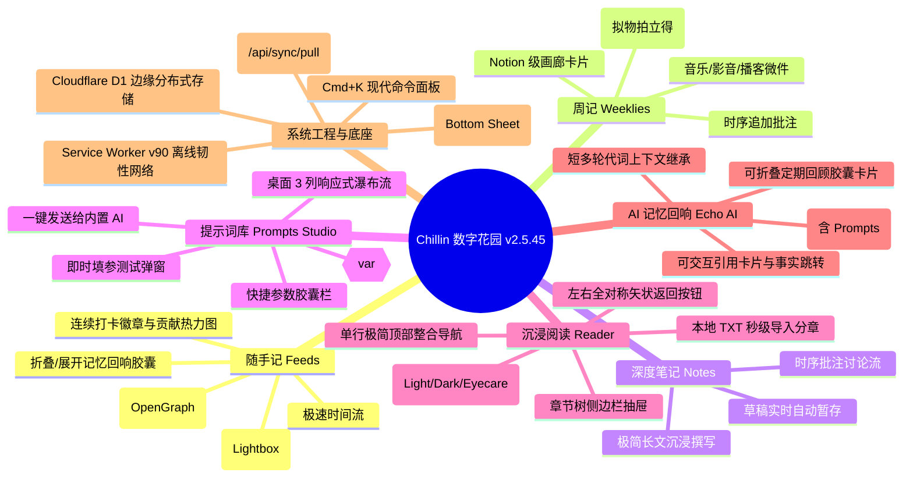

# Chillin 数字花园：产品全景与技术工程治理深度报告

> **编制对象**：产品经理 (Product Manager) / 技术负责人 / 架构师  
> **报告版本**：v2.5.45 (2026 年度技术演进、产品重构、安全加固与工程治理全景审计)  
> **应用形态**：Web / PWA (跨平台极速响应，双端工效学优化)  
> **在线基准**：Pages 前端 (v2.5.45, Service Worker `chillin-v92`) + Cloudflare Worker 边缘无服务架构 + Cloudflare D1 边缘关系型存储  
> **代码仓库**：[GitHub / 2089700996jy-del/chillin](https://github.com/2089700996jy-del/chillin)  

---

## 目录
1. [产品定位与核心价值主张 (Value Proposition)](#1-产品定位与核心价值主张)
2. [目标用户画像与核心使用场景 (User Personas & Scenarios)](#2-目标用户画像与核心使用场景)
3. [核心功能矩阵与业务能力拆解 (Feature Breakdown)](#3-核心功能矩阵与业务能力拆解)
4. [全端重构与产品体验护城河 (UX/UI & Design System)](#4-全端重构与产品体验护城河)
5. [AI 记忆回响系统 (RAG) 核心闭环与架构](#5-ai-记忆回响系统-rag-核心闭环与架构)
6. [技术架构、性能优势与工程化治理 (Technical Architecture)](#6-技术架构性能优势与工程化治理)
7. [竞品横向对比与差异化优势 (Competitive Analysis)](#7-竞品横向对比与差异化优势)
8. [演进路线图与落地进度 (Product Roadmap)](#8-演进路线图与落地进度)
9. [总结与商业价值评价 (Conclusion)](#9-总结与商业价值评价)

---

## 1. 产品定位与核心价值主张

### 1.1 产品定义
**Chillin** 是一款兼具**极致轻量、数据绝对可控、全端沉浸美学与 AI 深度联想**的个人跨端「数字花园（Digital Garden）」。它打破了传统笔记软件（笨重、依赖框架打包、启动缓慢、层级复杂）与碎片记录工具（易记难寻、缺乏归纳、信息孤岛）之间的壁垒，为用户提供一个**随手记录即成脉络、长久沉淀可被 AI 唤醒、多端操作无缝贴合工效学**的私人第二大脑。

### 1.2 核心价值金字塔
```
             ▲
            / \     【顶层：心智共鸣与记忆觉醒】
           /AI \    AI 记忆回响（RAG 全域联想、可折叠回响卡片、记忆来源双向交互跳转）
          / 回响 \
         /--------\ 【中层：结构编织与深度沉浸】
        / 结构化   \ Notion 级周记、时序批注、提示词库 (Studio)、单行极简沉浸阅读
       / 记录与阅读 \
      /--------------\ 【底层：极速捕获、全端工效与绝对自主】
     / 随手记 / PWA离线 \ 0依赖极速秒开、手势灯箱、半屏抽屉、三档全站主题、单RTT边缘同步
    /____________________\
```

* **零摩擦捕获 (Zero-Friction Capture)**：随手记 1 秒内完成记录，支持富链接自动解析（OpenGraph/Favicon）与图片多图预览，无排版心理负担。
* **去 AI 感的高级视觉 (De-AI Craftsmanship)**：摈弃烂大街的高饱和渐变与 AI 罐头标签，基于自然纸质暖灰（`#F8F9FA`）、全矢量精致 SVG 与统一层级，营造安宁自省的心智氛围。
* **第二大脑回响 (Second Brain Echo)**：不仅支持短多轮追问上下文继承，更能将 AI 思考精确溯源至原始周记、笔记、随手记及提示词，支持点击回跳闪烁定位。

---

## 2. 目标用户画像与核心使用场景

| 用户类型 | 典型画像 | 核心痛点 | Chillin 解决方案 |
| :--- | :--- | :--- | :--- |
| **知识工作者 / 独立开发者** | 习惯高频记录代码片段、设计灵感、AI Prompt 模板与技术专栏 | 传统笔记软件打开慢，Prompt 变量替换手工繁琐，桌面大屏空间利用率低 | 毫秒级秒开；1140px 桌面宽屏工作台；内置动态参数替换的 Prompt Studio 与三列卡片瀑布流；一键直发 AI |
| **生活记录者 / 自省复盘者** | 喜欢撰写深度周记，记录电影、音乐、烟火日常拍立得与认知复盘 | 微信朋友圈过于公开，Notion 移动端排版卡顿手感反人类 | 模块化周记系统，自适应比例画廊，拍立得生活照片墙，连续打卡徽章热力图，私密自控 |
| **重度阅读与沉浸学习者** | 经常阅读长篇小说、电子书、行业研报 | 常见小说 App 广告多、排版割裂、无法就地联动记笔记 | 内置 TXT 书架与阅读器，将控制栏无缝收编入顶栏单行，提供日间/夜间/护眼绿全站三档主题，精确阅读记忆 |
| **高流动性 / 移动办公族** | 常在地铁、飞机、弱网等复杂场景记录，多设备频繁切换 | 断网无法加载或抛语法错，多端数据覆盖冲突，流量消耗大 | PWA 离线自愈，Service Worker 全模块预缓存，单次 RTT 聚合拉取与 Delta 脏数据差异推送，断网自动补偿同步 |

---

## 3. 核心功能矩阵与业务能力拆解


```mermaid
mindmap
  root((Chillin 数字花园 v2.5.45))
    随手记 Feeds
      极速时间流
      外链卡片解析 (OpenGraph)
      全屏手势图片灯箱 (Lightbox)
      连续打卡徽章与贡献热力图
      折叠/展开记忆回响胶囊
    周记 Weeklies
      Notion 级画廊卡片
      烟火日常 (拟物拍立得)
      音乐/影音/播客微件
      时序追加批注
    深度笔记 Notes
      极简长文沉浸撰写
      草稿实时自动暂存
      时序批注讨论流
    提示词库 Prompts Studio
      参数化占位符 {{var}}
      快捷参数胶囊栏
      即时填参测试弹窗
      一键发送给内置 AI
      桌面 3 列响应式瀑布流
    沉浸阅读 Reader
      本地 TXT 秒级导入分章
      单行极简顶部整合导航
      左右全对称矢状返回按钮
      章节树侧边栏抽屉
      三档全站主题 (Light/Dark/Eyecare)
    AI 记忆回响 Echo AI
      全域资产索引 (含 Prompts)
      短多轮代词上下文继承
      可交互引用卡片与事实跳转
      可折叠定期回顾胶囊卡片
    系统工程与底座
      Cmd+K 现代命令面板
      全屏手势与半屏抽屉 (Bottom Sheet)
      单 RTT 聚合增量同步 (/api/sync/pull)
      Service Worker v90 离线韧性网络
      Cloudflare D1 边缘分布式存储
```

### 3.1 模块亮点升级

#### ① 随手记与富媒体矩阵 (Feeds & Rich Media)
* **全屏手势图片灯箱 (Lightbox Gallery)**：点击随手记中的图片，平滑弹出沉浸式全屏黑底画廊，支持多图手势滑动切换、缩放、原图下载与下拉手势关闭，媲美原生 iOS 照片流。
* **习惯养成打卡徽章 (Streak Badge)**：将随手记记录频率智能计算为连续记录天数徽章与动态热力流动，强化自律正向反馈。
* **外链卡片智能萃取**：自动抓取 URL 的 Favicon、OpenGraph 封面、标题与平台标识，自动拦截图片防盗链失效。

#### ② 提示词工程工作台 (Prompt Studio)
* **动态插值渲染**：支持 `{{变量名}}` 模板，自动提取参数生成输入表单。
* **桌面端三列瀑布流**：在桌面端视口（>768px）自适应采用 3 列技术网格（`minmax(340px, 1fr)`），搭配紧凑分类胶囊，操作路径大幅缩短。
* **一键打通 AI**：填参完毕后不仅可一键复制，更支持直发记忆回响 AI 对话框，快速得到执行结果。

#### ③ 沉浸式单行极简阅读器 (Full-Bleed Immersive Reader)
* **单行导航栏深度整合**：打破传统双层工具栏遮挡视野的弊端，将书名居中、目录侧边栏开关、主题切换全面整合进 54px 的单行顶部毛玻璃导航中。
* **矢量全对称 Chevron 与光学对齐**：使用标准 SF Symbols / Lucide 矢状几何路径 `<path d="M15 19l-7-7 7-7"/>`，配合 `translateY(-0.5px)` 进行汉字与矢量的黄金中轴对齐，消除移动端点击蓝色/绿色外边框。
* **全站三档主题自适应**：阅读模式的主题（Light / Dark / Eyecare）与全局页面样式系统深度联动，阅读进度和滚动百分比毫秒级持久化。

---

## 4. 全端重构与产品体验护城河

经过 v2.5.30 ~ v2.5.45 的深度迭代，Chillin 完成了从「功能可用」到「工业级美学与原生触感」的蜕变：

### 4.1 全面「去 AI 感」设计语言 (De-AI Craftsmanship)
* **温暖纸质基底**：页面底色从冷冰冰的刺眼纯白升级为柔和纸质灰（`#F8F9FA` / `#F2F2F7`），大面积阅读与写作不刺眼、无眩光。
* **矢量线性图标替代粗糙 Emoji**：系统各处原有的零散 Emoji 全面更替为笔触均一、语义精准的几何 SVG 图标，提升软件的严谨感与专业工具质感。
* **记忆回响卡片优雅收敛**：AI Echo 回响卡片由早期的强制占据首屏大横幅，重构为**精巧的可折叠胶囊卡片**，保留核心摘要与唤醒入口，将视线空间充分还给用户的内容创作。

### 4.2 移动端工效学优化 (Mobile Ergonomics)
* **半屏抽屉 (Bottom Sheet) 交互**：在移动设备上全面淘汰桌面遗留的居中 Modal 弹窗，新建随手记、批注、详情查看均采用单手拇指热区友好的半屏底部抽屉，支持自然下滑关闭。
* **软键盘智能避让与顶底栏联动**：在输入框唤起虚拟键盘时，底部导航栏（Bottom Nav）与悬浮按钮（FAB）自动平滑淡出，视口回弹平顺，防止遮挡光标视线。
* **Apple Spring 原生触感动效**：所有按钮绑定 `active: scale(0.96)` 阻尼微缩放，消除传统移动 Web 页面的滞涩感。

### 4.3 桌面端沉浸工作台 (Desktop Widescreen Workspace)
* **100% 边缘通栏毛玻璃顶栏 (Full-Width Edge-to-Edge)**：桌面端采用通栏全宽顶栏，搭配 `backdrop-filter: blur(20px)`，在页面滚动时呈现高级透光折射。
* **1140px 黄金约束视口**：内容区域从移动端单列扩展为 1140px 黄金居中视口，空间充裕的同时保证长行文字的最佳阅读眼球摆动角度。

### 4.4 全系统三档主题全量对齐 (Theme Parity)
系统全面实现三套主题的底层变量贯通：
* **纸感日间 (Light)**：`#F8F9FA`，清晰通透，适合日光办公。
* **深邃夜间 (Dark)**：`#0F1115`，OLED 纯黑优化与高对比度文字，夜间写作防疲劳。
* **温润护眼 (Eyecare)**：`#E8F0E0` + `#2E7D32`，专为长时间沉浸长文与电子书打造的温和豆沙绿。

---

## 5. AI 记忆回响系统 (RAG) 核心闭环与架构

Chillin 拒绝无意义的通用泛化聊天，专注打造基于个人历史数据的**“私人第二大脑记忆回响”**：

```
[ 用户提问 / 代词追问 ]
        │
        ▼
[ 多轮代词分析器 ] ──(抓取上下文指代核心名词)──┐
        │                                      │
        ▼                                      ▼
[ 自然语言时序解析 ]                        [ 关键词分词与停用词过滤 ]
(如: "上周的随手记")                                  │
        │                                      │
        └──────────────────┬───────────────────┘
                           ▼
              [ 边缘 RAG 混合召回引擎 ]
     ┌─────────────────────┼─────────────────────┐
     ▼                     ▼                     ▼
 [随手记流]              [周记/笔记]           [提示词库]
     └─────────────────────┬─────────────────────┘
                           ▼
              [ BM25/多特征时序加权排序与截断 ]
                           ▼
              [ 提示词注入 + DeepSeek / Workers AI ]
                           ▼
            [ 流式 SSE 打字机响应 + 可交互溯源卡片 ]
                           │
                           ▼
           [ 用户点击卡片 ➔ 页面平滑回跳原始条目并高亮闪烁 ]
```

### 5.1 体验核心亮点
1. **短多轮代词继承**：当用户在连续对话中追问“它什么时候记的？”或“还有更详细的吗？”，系统自动溯源上一轮对话的核心实体并入检索，消除指代消解失败的缺陷。
2. **提示词全域入库**：Prompts 库作为一等公民参与 RAG，用户可直接询问“我以前写过什么翻译提示词”，AI 会提取精准卡片供即时复用。
3. **事实溯源与闭环回跳**：AI 回答底部的引用卡片支持点击。点击后，AI 弹窗自动淡出，界面直接平滑滚动定位到原随手记、周记或笔记，并触发 CSS 脉冲高亮，实现由“AI 生成”到“原汁原味事实证据”的无缝闭环。

---

## 6. 技术架构、性能优势与工程化治理

### 6.1 前后端技术拓扑与 Zero-Build 哲学
* **前端架构**：原生 HTML5 + Vanilla CSS + 原生 ES Modules（**Zero-Build 零构建打包负担**）。
  * 摒弃 Webpack / Vite 庞大的 `node_modules` 依赖链与打包黑盒，所写即所跑，调试零延迟。
  * 没有任何虚拟 DOM 渲染开销，在低性能移动设备上拥有极高帧率和极低能耗。
* **后端架构**：**Cloudflare Workers** 边缘无服务器运行环境，全球边缘节点就近调度，冷启动时间 < 5ms。
* **边缘关系存储**：**Cloudflare D1**（基于 SQLite 的高一致性边缘分布式存储，与 Worker 处于极近网络拓扑）。

### 6.2 关键性能工程亮点

#### ① 聚合增量拉取 (`GET /api/sync/pull`)
* **痛点**：传统模式拉取 5 张表需客户端串行或并发发起 5~6 次 HTTP 请求，弱网下高 RTT 导致首屏明显延迟。
* **优化方案**：服务端提供单次聚合接口，在 D1 内部并行并发查询后打包一次性输出，**将移动端全量同步网络往返严格压缩为 1 次 RTT**。客户端保持优雅降级并发回退机制，保障可用性达 99.99%。

#### ② 精准差异脏数据推送 (Delta Push)
* 本地记录被修改或新建时，打上 `_dirty: true` 标记。
* 批量同步时，网络管道仅序列化传输带有脏标记的数据行，彻底避免全量上报对网络流量的浪费与数据库行版本的污染。

#### ③ 工业级 PWA 离线韧性网络 (v90)
* **Service Worker 模块化全量缓存**：预缓存全部 20 个 ES 业务子模块，彻底终结了断网时拉取 JS 降级为 HTML 导致的 `Uncaught SyntaxError` 页面白屏崩溃。
* **版本探测与平滑更新**：`version.json` 强绕过 SW 缓存拦截，后台定期毫秒级轻量探活。探测到新版本后静默拉取资源，提供“检测到新版本，点击即时生效”的平滑热更新体验。
* **断网感知与自动补偿重连**：监听 `online` / `offline` 事件，断网时安全切换离线提示，重连瞬间自动静默发起云端差异同步，无缝抹平网络颠簸。

#### ④ 后端模块化解耦与微内核治理
单体 `api.js` 完全解耦为 6 大专业职责子域：
* `security.js`：动态盐 PBKDF2 强散列（10 万次迭代）、时序安全比较、文件二进制魔数嗅探、16 字节 IPv6 解析与内嵌 IPv4 判定（封堵 `::ffff:` 映射、NAT64 `64:ff9b::/96`、6to4、Teredo 及 `localhost.` 尾点绕过）、14 组私网/云元数据 CIDR 拦截与共享限流计数。
* `auth.js`：高安全 Session 鉴权、Cookie 状态维护、Web Push 订阅管理。
* `garden-shared.js` / `garden-media.js` / `garden-resources.js` / `garden-sync.js` / `garden-echo.js`：按资源与职责拆分的领域模块（原先合并在一个 999 行的 `garden.js` 中）——共享辅助、媒体与外链、五类资源 CRUD、聚合同步与热力图、回响卡片与审计。
* `rag.js`：自然语言分词、停用词表、多轮上下文继承、时序过滤与打分算法。
* `llm.js`：DeepSeek / Cloudflare Workers AI 流式 SSE 对接与合规检测。
* `audit.js`：定时 Cron 自动化内容违规扫描、敏感词过滤与隔离区备份。

#### ⑤ 安全加固批次（v2.5.38 → v2.5.45）
在保持零构建与原有交互不变的前提下，完成了一轮系统性安全加固与工程一致性修复：

| 主题 | 加固内容 |
| :--- | :--- |
| **会话安全** | 登录/注册下发 `HttpOnly + SameSite=Lax`（HTTPS 附带 `Secure`）会话 Cookie，兼容旧版 `Bearer` 令牌；**数据库只保存令牌的 SHA-256 摘要**，旧明文会话在首次鉴权时透明升级；新增「全部退出」(`POST /api/auth/logout-all`) |
| **CSP 收紧** | `script-src` 移除 `'unsafe-inline'`：`index.html` 的 18 个内联 `onclick` 与模板生成的 9 个内联处理器全部改为事件委托（弹层遮罩/关闭按钮/图片灯箱/章节树/回响折叠在 `app.js` 统一代理，图片失败兜底走捕获阶段）；两段内联引导脚本改用 sha256 白名单，测试会重算哈希防止再次漂移 |
| **SSRF 加固** | 16 字节 IPv6 解析 + 内嵌 IPv4 判定，封堵 `[::ffff:a9fe:a9fe]`（云元数据）、NAT64 `64:ff9b::/96`、6to4、Teredo 与 `localhost.` / `127.0.0.1.` 尾点绕过；解析失败一律 fail-closed |
| **限流跨实例** | `checkRateLimitShared()`：isolate 内存桶快速拒绝 + D1 原子计数（`rate_limits` 表），D1 异常自动降级；登录额外按账号锁定（15 分钟 10 次）；反代透传真实客户端 IP（共享密钥校验，见 `functions/api/[[path]].js`） |
| **响应头** | Pages 与 Worker 均补齐 `Strict-Transport-Security`，API/文件响应追加 `default-src 'none'` 的 CSP 兜底 |
| **上传防护** | 先校验 `Content-Length` 与 `Blob.size` 再读入内存，避免超标请求撑爆 Worker 内存 |
| **工程一致性** | 修复 bump 脚本「按当前版本字面量替换」导致的版本漂移（改为正则重写 6 处锚点）；`.gitattributes` 固定 `eol=lf`，避免 CRLF/LF 差异导致 CSP 哈希失配；`.agents/skills/konsta-ui-repo` 第三方快照移出 git 跟踪 |

数据层同步新增 `migrations/0015_session_token_hardening.sql`（`sessions(user_id)` 索引）与 `migrations/0016_shared_rate_limits.sql`（跨实例限流表 + 索引），远端 D1 均已对齐。

#### ⑥ 原生自动化测试套件
采用 Node.js 20+ 原生测试运行器（`node --test`），无需安装 Jest/Vitest 等第三方重型工具：
* 包含 RAG 分词、时间解析、记忆评分、搜索高亮与防 XSS、二进制魔数嗅探、SSRF 私网阻断与 IPv6 绕过、时序安全校验、密码规则、会话令牌哈希、CSP 哈希守卫、共享限流降级、审计保留策略、PWA 预缓存守卫、网关架构红线、数据增量合并等 **28 个核心测试套件**；
* **测试全量执行耗时通常 < 1s**（含读取 `index.html` 校验 CSP 哈希的静态检查），保证代码提交即验证，杜绝逻辑倒退。

---

#### ⑦ 工程化与体验收尾（v2.5.44 → v2.5.45）
* **CI 门禁**：[`.github/workflows/ci.yml`](../.github/workflows/ci.yml) 在每次 push / PR 执行 `npm test` 与 `wrangler deploy --dry-run`（浅克隆，规避历史大对象）；
* **数据可运维**：`npm run backup` 远端导出 + gzip 轮转保留 14 份；`GET /api/health` 暴露版本与 D1 可达性，可直接接 Uptime 监控；
* **依赖自持**：DOMPurify 自托管，浏览器运行时**零第三方请求**；wrangler 与 `compatibility_date` 保持最新；
* **发布流程**：`npm run ship` 先跑门禁、再版本联动、强制 Conventional Commits，并自动重生成 `CHANGELOG.md`；
* **无障碍**：原生 `confirm/alert` 全部替换为应用内弹窗与 toast；弹层具备 `role=dialog`/`aria-modal`、焦点陷阱、Esc 关闭与焦点归还；
* **同步健壮性**：缺失客户端 id 的本地改动不再被静默丢弃（推送前补 id），避免重复记录与永久脏标记。

## 7. 竞品横向对比与差异化优势

| 对比维度 | Notion | Flomo 浮墨笔记 | Obsidian | **Chillin (本项目 v2.5.45)** |
| :--- | :--- | :--- | :--- | :--- |
| **首屏启动耗时** | 慢（2~4秒，庞大框架包） | 快（<1秒） | 中等（受本地插件影响） | **极快 (< 200ms 秒开，Zero-Build)** |
| **跨端与安装成本** | 需安装大型客户端 / 打开慢 | Web / 微信小程序 | 需自行配置多端同步或付费 | **原生 PWA，浏览器直达，零构建负担** |
| **视觉与交互质感** | 偏商业冷淡工作台 | 极简单色信息流 | 极客 Markdown 风格 | **Apple HIG + 去 AI 感纸质美学 + 动效微阻尼** |
| **手势与工效设计** | 移动端操作繁琐 | 基础移动交互 | 移动端适配一般 | **全屏手势图片灯箱 + 单手半屏抽屉 (Bottom Sheet)** |
| **结构化与生活微件** | 强但过于繁重 | 纯碎片流水账 | 依靠复杂插件拼装 | **适度平衡：Notion 级画廊 + 拍立得日常 + 提示词库** |
| **AI 记忆融合能力** | 通用 AI 生成，割裂 | 无深度私有 RAG | 需折腾本地大模型/第三方 API | **原生混合 RAG，多轮继承，引用事实交互回跳** |
| **离线可用与自愈** | 极度依赖网络，断网受阻 | 弱 | 极强（本地纯文本） | **强（Service Worker v90 模块预缓存 + 自动补偿同步）** |
| **私密性与部署主权** | 闭源商业中心化云 | 闭源商业中心化云 | 本地私有 | **代码 100% 开源私有，数据归属个人边缘 D1 库** |

---

## 8. 演进路线图与落地进度

### 8.1 阶段演进总览
```
2026 Q3~Q4 (已全部高质量落地)              2027 Q1 (下一阶段：连接与沉淀)             2027 Q2 (生态与高级工效)
┌─────────────────────────────────┐       ┌─────────────────────────────────┐       ┌─────────────────────────────────┐
│ [✓] 核心解耦与 13 原生单测体系   │       │ • 个人知识关联图谱 (Graph View)  │       │ • 端到端全量数据离线加密导出/恢复│
│ [✓] Cmd+K 现代命令面板与键盘流  │       │ • 随手记语音速记 (Web Speech/AI) │       │ • 微信/邮件轻量打卡直达通道     │
│ [✓] SW v90 模块离线白屏彻底根治  │ ───>  │ • 随手记富文本轻量排版           │ ───>  │ • 提示词一键分享广场与协作导入   │
│ [✓] 去 AI 感设计与全站三档主题   │       │ • 记忆回响本地小模型离线推理     │       │ • 桌面端专属多窗口快捷唤起微件   │
│ [✓] 移动端手势灯箱与半屏抽屉     │       │ • 周记导出为精美长图/PDF         │       │ • 智能双向链接与引用反查         │
│ [✓] 单行极简阅读器与光学对齐     │       └─────────────────────────────────┘       └─────────────────────────────────┘
└─────────────────────────────────┘
```

### 8.2 下一阶段重点规划任务 (Backlog)
1. **P1 - 个人记忆关联图谱 (Force-Directed Graph View)**：
   * 基于随手记、周记与笔记的标签系统与关键词共现关系，在前端基于 Canvas/SVG 渲染轻量级力导向关联图谱，让用户直观漫步在自己的思维网络中。
2. **P1 - 随手记语音速记转文字 (Voice Capture)**：
   * 结合浏览器 Web Speech API 与 Cloudflare Workers AI Whisper 语音识别模型，在底部抽屉提供长按录音速记功能，将灵感记录阻力压缩至 0 秒。
3. **P1 - 本地数据自主便携性 (Full Data Portability)**：
   * 在设置面板中增加可视化一键打包导出功能（JSON 完整元数据 + Markdown 原文归档 + 媒体资源包），贯彻“数据永远属于用户”的自主原则。
4. **P2 - 周记与随手记精美海报长图导出**：
   * 结合 HTML5 Canvas 将拍立得烟火日常与模块化周记一键渲染为高颜值分享长图，方便用户在社交圈低调分享生活复盘。

---

## 9. 总结与商业价值评价

**Chillin (v2.5.45)** 展现了一个现代个人效率工具的范本形态：

1. **工程理念领先**：在前端框架日益繁复沉重的当下，Chillin 坚持 **Zero-Build 零构建打包哲学**，以纯粹的原生 ES Modules + Vanilla CSS 构建出启动超快、交互极度细腻的现代化 Web/PWA 应用。
2. **极致工效与高级审美**：无论是移动端全屏手势图片灯箱、大拇指半屏抽屉，还是桌面端通栏毛玻璃与 1140px 宽屏工作台，抑或单行极简阅读器中的黄金矢量 Chevron 对齐，均体现出对标 Apple HIG 的工匠精神，彻底剥离了 AI 生成界面的廉价与粗糙感。
3. **第二大脑的真实价值闭环**：通过边缘 Worker + D1 配合深度定制的 RAG 混合召回引擎，让碎片信息与长文沉淀能够被精准检索，支持代词上下文继承与事实反向溯源跳转，真正让散落的日常变成了“活”的个人智慧资产。

Chillin 既可以作为极客与创作者完全私有化部署的私人数字花园，也具备演进为面向知识精英的高口碑独立商业产品的完整产品力。
